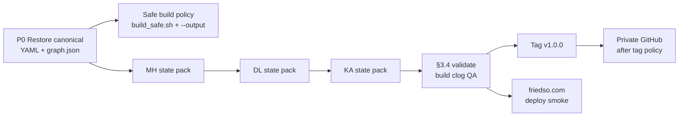

# JEM — Daily schedule & v1.0.0 completion plan

**Threads 1–2 deliverable:** Cursor-safe planning (no Mermaid `gantt` — use tables + flowchart below).  
**Last updated:** 2026-05-20  

---

## Current baseline (May 2026)

| Signal | Value | Implication |
|--------|--------|----------------|
| Repo-root `graph.json` | **~1.87 MB**, **505** entities | Full corpus built; shippable after friedso smoke tests. |
| Entity YAML | **494+** files under `jem/data/entities/` | MH, DL, KA, TN, PY + backbone in repo. |
| `jem/web/public/graph.json` | Symlink → `../../../graph.json` | Deploy must ship **repo-root `graph.json`** to `public/graph.json` on host (see release runbook). |

**Next:** Operator runs [`V1_RELEASE_RUNBOOK.md`](V1_RELEASE_RUNBOOK.md) (deploy → smoke → tag). GitHub push/CI → **v2** (MASTER_CHECKLIST Part 4.3).

---

## Definition of done — v1.0.0 (from MASTER_CHECKLIST §3.4)

1. **Coverage:** National backbone + **TN + PY + MH + DL + KA** present in YAML (not only placeholders from `build.py`).
2. **Scale:** After `python scripts/build.py` (intentionally to repo root when ready): `meta.entity_count` **~390–420**, `graph.json` **~2.0–2.5 MB** (order-of-magnitude per checklist).
3. **Quality:** `python scripts/validate.py --strict` → **0 errors**.
4. **Derivation:** `python scripts/derive.py` + `python scripts/derive.py --clog-report` — spot-check high-volume courts (e.g. City Civil Mumbai, Tis Hazari) when MH/DL YAML exists.
5. **Release:** `git tag v1.0.0 && git push --tags` after deploy smoke on **friedso.com**.

---

## Dependency flow (read before the day-by-day table)

---

## Daily schedule (adjust anchor date to your “day 1”)

Anchor **day 1** = first day you have **canonical `graph.json` + YAML tree** on disk (or commit to restore from). Until then, compress “MH slice” days into “continue P0 search / obtain export”.

| Calendar day | Workstream | Concrete actions |
|--------------|------------|-------------------|
| **D1** | P0 | Obtain backup: full `graph.json` (~800 KB–1 MB+) + full `jem/data/entities/**`, `relationships/**`. Verify no duplicate `id` across files (`rg "^id:"` audit). |
| **D2** | P0 + safety | Copy canonical `graph.json` to repo root; confirm symlink `jem/web/public/graph.json` resolves; open app locally. Run `validate.py --strict`. Use **`jem/scripts/build_safe.sh`** for any experiment builds. |
| **D3** | MH §3.1.1–3.1.3 | New `jem/data/entities/subordinate_courts/mh_state_entities.yaml` (or split files if preferred): regulators + oversight + prosecution slice; cite sources. |
| **D4** | MH §3.1.4–3.1.5 | Consumer + city civil court Mumbai entry + gaps per checklist. |
| **D5** | MH §3.1.6 | Ten priority district courts + `mh_district_courts_generic`. |
| **D6** | MH §3.1.7–3.1.8 | Special courts + **`jem/data/relationships/mh_relationships.yaml`**: appellate to `hc_bombay`, CDRC→NCDRC, MERC→APTEL, etc. |
| **D7** | MH harden | `validate --strict` → `derive` → **`build.py` only when counts match expectations** (or keep using `--output` until graph size is right). Commit `data(MH): …`. |
| **D8–D10** | DL | §3.2 blocks: LG, regulators, districts, **`dl_relationships.yaml`**. |
| **D11–D14** | KA | §3.3 blocks + **`ka_relationships.yaml`**. |
| **D15** | §3.4 | Full strict validate; full build to repo root; entity count ~390–420; clog report; friedso smoke tests. |
| **D16** | Release | `git tag v1.0.0`, push tags, private GitHub if that is your policy. |

If **D1–D2 slip**, slide the whole table — do not start MH authoring on a 13-entity graph as “truth.”

---

## May 20 vs stretch (if you still track that milestone)

| Target | By ~2026-05-20 | Stretch |
|--------|----------------|--------|
| Minimum | P0 locate + restore **or** freeze scope doc + **safe build** in repo | Full MH pack |
| Ideal | P0 + **MH slice 1–2** (regulators + consumer skeleton) | MH relationships complete |

---

## Token / tool split (reminder)

| Work | Tool |
|------|------|
| Bulk YAML (districts, CDRCs) | Cursor |
| `validate` / `derive` / `build_safe` | Terminal |
| Schema / new `derive` formulas / gap reasoning | Short Claude sessions |
| Essay / policy writing | Separate Claude session |

Reserve **10%** of weekly AI budget for other repos.

---

## Related files in this repo

| File | Purpose |
|------|---------|
| `jem/scripts/build_safe.sh` | Writes **`jem/build/graph.staging.json`** only — does not overwrite repo-root `graph.json`. |
| `jem/docs/V1_DATA_RESTORE.md` | Step-by-step restore + verification. |
| `MASTER_CHECKLIST.md` | Authoritative task list — keep checkboxes in sync as you finish slices. |
