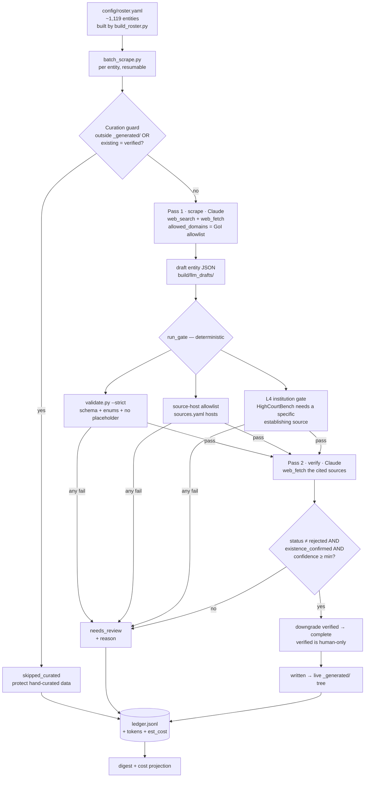

# Automated Scrape Pipeline — Flow & Gates

How `scripts/batch_scrape.py` turns the entity roster into verified YAML. Two LLM passes, three
gate layers; only entities clearing every gate touch the live tree, everything else is queued for
a human with its reason.

## Flow



## The gates, in order

| # | Gate | Where | Rejects |
|---|------|-------|---------|
| 0 | **Curation guard** | `batch_scrape.process_entity` | Entities outside `_generated/`, or an existing file already `data_quality: verified` — never overwrites hand-curated data. |
| 1a | **Schema** (`validate.py --strict`) | `run_gate` | Bad/missing required fields, wrong enum values, `placeholder` URLs. |
| 1b | **Host allowlist** | `run_gate` | Any `sources[].url` on a host not in `sources.yaml` (catches hallucinated / non-GoI hosts). |
| 1c | **L4 institution** | `run_gate._l4_institution_check` | A `HighCourtBench` whose sources are generic-only (Constitution + GoIWebsite/NJDG). Passing needs one of: Gazette, Central/State Act, SC/HC Judgment, OfficialReport, AnnualReport. This is the rule that would have caught the phantom Trichy bench. |
| 2 | **Adversarial verifier** | `verify_entity` + `entity_verify_v1.md` | Pass 2 re-fetches the cited sources and returns `{verification_status, confidence, existence_confirmed}`. `rejected` never writes; existence must be confirmed; confidence must clear the bar. |

**Two independent LLM passes** matter: Pass 1 (author) and Pass 2 (skeptic) use separate prompts,
so the verifier is checking the author's work against the actual sources rather than trusting it.

## Strictness knobs

Gates 1c and 2 are relaxable per run (no code edits):

```bash
--min-confidence 0.70   # write bar for the verifier (default 0.70)
--strict-verify         # require status=confirmed (default also accepts needs_human)
--no-l4                 # disable the L4 institution gate
```

Defaults are the "less strict" profile: `min-confidence 0.70`, `needs_human` writable when
existence is confirmed, L4 accepting official GoI reports. Trichy's generic-only case still fails
regardless.

## Outcomes

Every entity lands in exactly one bucket, recorded in `ledger.jsonl`:

- **written** — cleared all gates → live `_generated/` tree (or `run_dir/would_write/` under `--dry-run`).
- **needs_review** — failed gate 1 or 2 → `build/needs_review/<id>.yaml` + `<id>.review.json` with the reason.
- **skipped_curated** — curation guard tripped; untouched.
- **failed** — an exception (network, parse); isolated, the run continues.

The run is **resumable** (`--resume` skips already-done ids) and each row carries token counts +
`est_cost_usd`, which the digest sums and projects to the full 1,500.

## Entry points

```bash
python scripts/build_roster.py                 # (re)build config/roster.yaml
scripts/test_scrape.sh hc_madras hc_bombay     # manual dry-run of a few entities
python scripts/batch_scrape.py --resume        # full sweep
scripts/run_batch_scrape.sh                     # cron body (weekly launchd / crontab)
```
